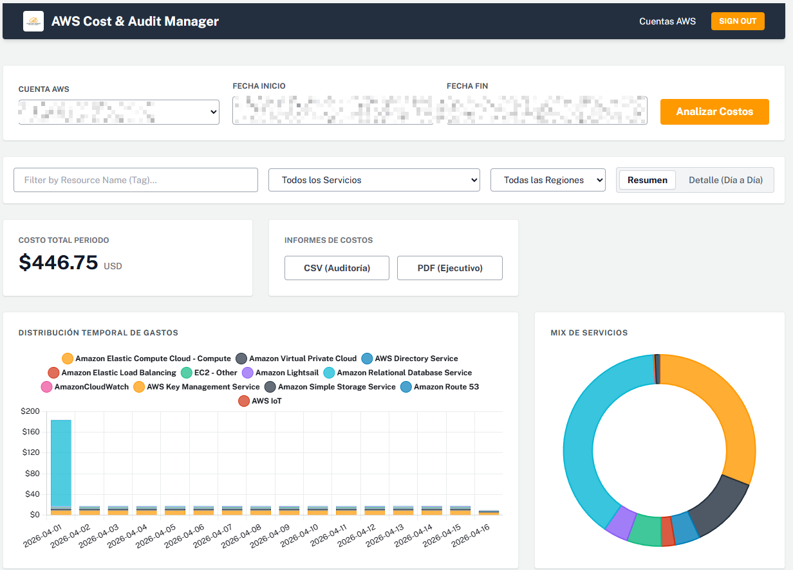
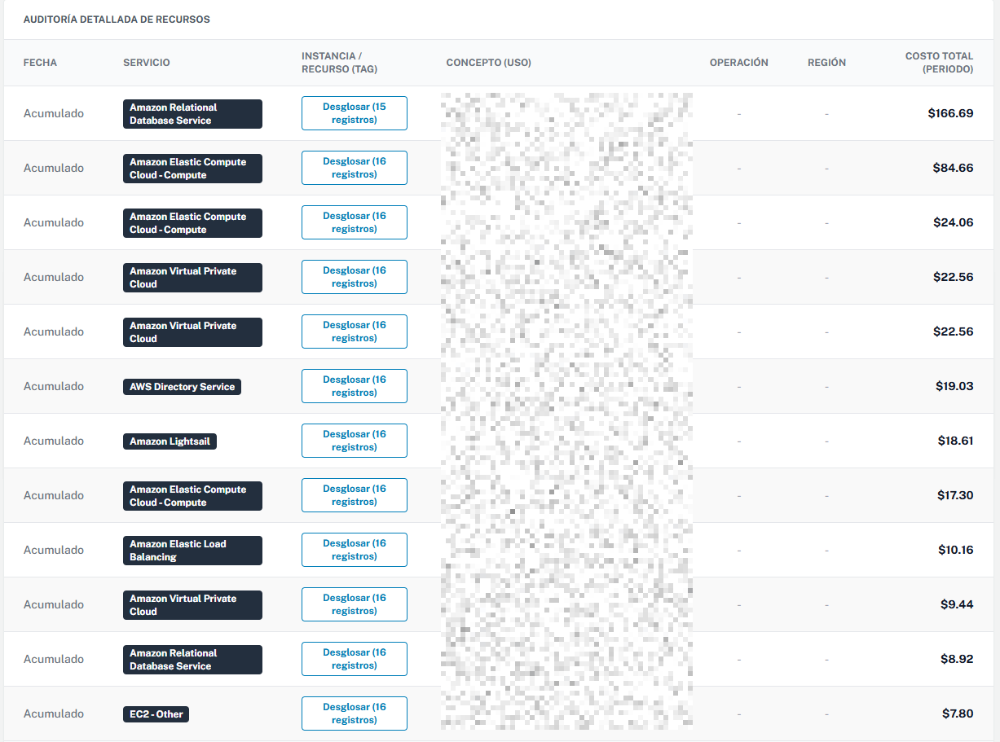

# AWS Cost Explorer

Una herramienta web integral desarrollada en Python (Flask) diseñada para conectarse a través de la API al servicio de **AWS Cost Explorer** y proveer resúmenes ejecutivos, reportes dinámicos y funciones de exportación (CSV / PDF) para monitorear eficazmente el consumo y el gasto incurrido a distintos niveles de las infraestructuras cloud.

## Screenshots

| Dashboard Principal | Detalle de Costos |
|---|---|
|  |  |

## Características

- 🔐 **Autenticación con JWT**: Acceso seguro con roles (Admin/User).
- 🔑 **Cifrado de Secret Keys**: Las credenciales de AWS introducidas en el sistema se encriptan de forma segura antes de ser almacenadas en la base de datos MongoDB.
- 📊 **Análisis y Extracción Detallada**: Obtención de grupos de información a nivel granular provistos por Boto3 (SDK AWS).
- 💾 **Caché en MongoDB**: Guardado de extracciones en la base de datos para acelerar las futuras consultas a lo largo del periodo visualizado, permitiendo agregaciones y filtrados instantáneos.
- 📉 **Exportación Múltiple**: Descarga en formato estandar CSV o reportes de resumen ejecutivo formal en PDF utilizando `Reportlab` y `Pandas`.

## Requisitos Previos

- **Python:** 3.8+
- **MongoDB:** Instalado y corriendo en el puerto por defecto, o proveer la URI de conexión.
- **Claves de AWS:** Para interactuar, se requiere agregar una cuenta desde el dashboard con una `Access Key` y `Secret Key` proveídos por el IAM de AWS (El usuario IAM solo requiere los permisos de `ce:GetCostAndUsage`).

## Instalación y Ejecución Local

1.  **Clonar el repositorio:**
    ```bash
    git clone https://github.com/jh4n3r/aws-cost-explorer.git
    cd aws-cost-explorer
    ```

2.  **Crear y activar un entorno virtual (Recomendado):**
    ```bash
    python -m venv venv
    # Navegadores en Windows:
    .\venv\Scripts\activate
    # Usuarios de macOS/Linux:
    source venv/bin/activate
    ```

3.  **Instalar dependencias:**
    ```bash
    pip install -r requirements.txt
    ```

4.  **Generar Clave Maestra de Encriptación (`encryption.key`):**
    Asegúrate de configurar los aspectos del cifrado de primera instancia o la aplicación no podrá arrancar. Ver que exista un script de inicialización de BBDD/Llaves o correr las directivas necesarias del backend.

5.  **Ejecutar el servidor Flask:**
    ```bash
    python app.py
    ```

6.  La aplicación ahora estará escuchando en `http://localhost:5000`.

## Primer Inicio de Sesión

Si es la primera vez que ejecutas la app y la base de datos está vacía, se creará un usuario administrador por defecto:
- **Usuario:** `admin`
- **Contraseña:** `admin123`

> [!TIP]
> **¿Cómo cambiar esta contraseña?**
> Para mantener la seguridad, inicia sesión con este usuario, crea un **nuevo** usuario (asegúrate de darle el rol de `admin`) con tu contraseña definitiva. Luego, cierra sesión, ingresa con tu nuevo administrador, y elimina la cuenta `admin` inicial.

## Documentación Técnica
Para una vista en profundidad de los modelos, seguridad, y las rutas de API conéctate y lee nuestro archivo [DOCUMENTATION.md](DOCUMENTATION.md).

## Licencia
Licencia MIT.
